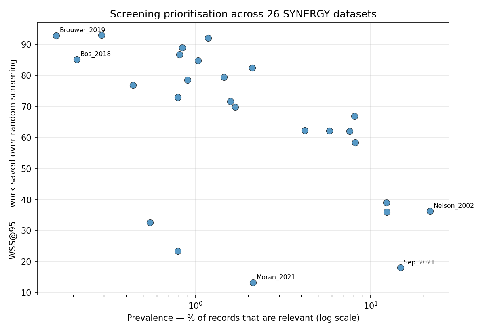

# Active-learning abstract screening for systematic reviews

Systematic reviews require a human to read thousands of abstracts to find the
handful that are actually relevant — typically 1–2% of the corpus. This tool
prioritises the reading order using active learning, so most relevant papers
surface early and the rest of the corpus can be left unread.

Benchmarked across all 26 datasets in the
[SYNERGY](https://github.com/asreview/synergy-dataset) collection.

## Headline result

**Mean WSS@95 of 64.1 across 26 datasets** (range 13.3–93.0, 3 seeds per dataset).

WSS@95 = the percentage of the corpus you avoid reading, relative to random
screening, while still finding 95% of the relevant papers. On
`van_de_Schoot_2018`, 95% recall is reached after screening 6.1% of 4,544 records.



The figure shows the finding I think is most worth stating: **WSS@95 is not a
property of the method alone — it is strongly conditioned on prevalence**
(Spearman ρ = −0.62, p = 0.0007). Reporting a single dataset's WSS@95 without its
prevalence is close to meaningless, which is why the result above is a distribution
rather than a number.

Prevalence is not the whole story either. It explains under 40% of the variance,
and several datasets defy it badly — `Moran_2021` (2.13% prevalence) scores 13.3
while `Hall_2012` (1.18%) scores 92.0. Why some reviews resist prioritisation is
an open question in this repo, not a solved one.

## Method

- **Data:** SYNERGY, 26 labelled systematic reviews, 258–48,375 records,
  0.16%–21.9% prevalence.
- **Features:** TF-IDF over title + abstract, fitted once on the full corpus.
- **Model:** logistic regression with balanced class weights, refitted as labels
  arrive.
- **Query strategy:** relevance sampling — screen the record with the highest
  predicted P(include).
- **Baseline:** random screening order.
- **Metrics:** WSS@95 and recall-at-effort. Not accuracy or AUC, which are
  misleading at 0.16% prevalence — a classifier predicting "exclude" for every
  record scores 99.84% accuracy and is useless.

### Why relevance sampling, not uncertainty sampling

Standard active learning queries the *least confident* record, because the goal is
to improve the classifier using as few labels as possible. That is the wrong
objective here. A reviewer does not care how good the model becomes; they care how
few abstracts they have to read. The objective is recall and ranking, so the loop
queries the *most likely positive* instead.

## Validation against the reference implementation

Reproducing your own results proves only that the code agrees with itself. To check
correctness, I ran ASReview — the standard tool in this field — on the same dataset
under a matched configuration and compared WSS@95 directly.

**Metric definition.** The implementation here computes WSS@95 = 95% − (% screened
at 95% recall). This matches Cohen et al. (2006): WSS@r = (TN+FN)/N − 1 + r. At the
stopping point the unscreened records are exactly TN+FN, so (TN+FN)/N = 1−s, giving
WSS@95 = 0.95 − s. No correction term is missing.

**Head-to-head, `Nelson_2002`, ASReview 1.6.6, five matched seeds:**

| seed | this repo | ASReview | difference |
|------|-----------|----------|------------|
| 0 | 33.0 | 39.3 | −6.3 |
| 1 | 45.5 | 32.7 | +12.8 |
| 2 | 30.5 | 33.5 | −3.0 |
| 3 | 37.6 | 36.5 | +1.1 |
| 4 | 34.9 | 35.2 | −0.3 |

Mean signed difference **+0.9 percentage points**; mean absolute difference 4.7. The
sign flips across seeds, so there is no systematic bias — per-seed differences are
noise, not a ranking error. Over ten seeds the means are near-identical (35.5 here,
35.4 for ASReview).

Configuration matched as far as the APIs allow: logistic regression, TF-IDF, `max`
querier, balanced class weighting. Worth noting that `max` — relevance sampling — is
ASReview's *default* query strategy, which independently corroborates the design
choice argued for above. ASReview's default classifier is naive Bayes, so it was
configured down to match; this shows agreement under matched configuration, not
agreement with ASReview at its best.

**One unflattering difference.** Seed-to-seed variance is higher here: SD 6.0 versus
ASReview's 2.6. I tested the obvious explanation — that the 10-record seed set
(versus ASReview's 2) makes the starting point vary more. Reducing to 2 seed records
lowers SD to 4.4, so that is part of it, but not all of it; the remainder is
presumably TF-IDF parameters or the balancing strategy. Reducing the seed set also
moves the mean *away* from ASReview's (38.4 vs 35.4), so the current setting agrees
better on central tendency and worse on stability. Not resolved.

**Scope.** Five seeds on one small, high-prevalence dataset is thin. ASReview 1.x
and 2.x have different defaults and are not interchangeable — these numbers are
v1.6.6. Reproduce with `python3 -m src.validate Nelson_2002 --seeds 0 1 2 3 4`
(requires `pip install asreview asreview-insights`).

## Testing whether embeddings help on lexically heterogeneous datasets

The cohesion analysis above found that `Moran_2021`'s included studies are
unusually dissimilar to each other under TF-IDF (cohesion ratio 1.27, lowest in
the collection) and left open whether this reflects a genuine absence of textual
signal or a limitation of TF-IDF specifically. Published comparisons already show
TF-IDF beating sentence-transformer embeddings on this task on average (see
references below), so re-running that comparison broadly would mostly replicate a
known result. Instead I tested a narrower, directional prediction: that whatever
advantage embeddings have should concentrate on datasets like `Moran_2021`, where
lexical overlap between positives is weakest and a semantic representation might
recover relationships TF-IDF cannot see.

**The result is the opposite of the prediction, and it reproduces.** Comparing
TF-IDF against `all-MiniLM-L6-v2` embeddings (identical splits, `precomputed_X`
swapped, 10 seeds) on `Moran_2021`:

| feature | mean WSS@95 | SD | range |
|---|---|---|---|
| TF-IDF | 13.7 | 0.4 | 13.1–14.3 |
| embedding | 5.0 | 0.7 | 4.1–6.6 |

The two distributions do not overlap across 10 seeds — TF-IDF's worst run (13.1)
still beats the embedding's best (6.6). `Sep_2021`, the other markedly
low-cohesion dataset, shows the same direction though with more seed noise
(TF-IDF 24.2 ± 7.1 vs embedding 16.5 ± 3.2, overlapping ranges).

An initial 8-dataset, 3-seed screen (4 low-cohesion, 4 high-cohesion, split by
`cohesion_ratio`) pointed the same way: mean delta was +1.6 WSS points for
embeddings on the high-cohesion control group and −1.7 on the low-cohesion group
— embeddings did comparatively *worse*, not better, exactly where the hypothesis
predicted an advantage. That aggregate was driven almost entirely by `Moran_2021`;
the seed-robustness check above confirms that dataset's effect is real rather than
a single unlucky draw.

**So the heterogeneity hypothesis is falsified as a predictor of when embeddings
help, and it points the wrong direction on the one dataset it explains best as a
description.** A candidate mechanism, untested: TF-IDF can only rank a record
highly if it shares literal vocabulary with an already-labelled positive, which is
a conservative failure mode when positives are lexically scattered — it stays
close to a small, honest signal. A dense 384-dimensional embedding space, given
only ~10 labelled seed points, may place topically-adjacent but practically
unrelated abstracts close together, producing a confident but wrong ranking. This
is speculation, not demonstrated here.

**This is consistent with the wider literature**, which finds TF-IDF (typically
with naive Bayes or SVM) outperforming SBERT and even domain-specific transformers
like SPECTER across independent SYNERGY/ASReview benchmarks, in some cases with
severe degradation from transformer-based features at high recall thresholds.
That the gap is largest on the dataset most favourable to the embeddings
hypothesis, rather than smallest, is the actual finding here.

Reproduce: `pip install sentence-transformers && python3 -m src.compare_embeddings`

## Limitations

Quantified rather than hedged:

1. **Warm-start assumption.** The seed set is forced to contain at least one known
   positive, because a classifier cannot fit on a single class. This hides the cost
   of finding that first positive — expected at (N+1)/(P+1) draws under random
   search. On `Chou_2004` that is 10.0% of the corpus, on `Bos_2018` 9.1%, against
   reported efforts of 62.4% and 9.8% respectively. On `Bos_2018` this roughly
   doubles the true cost. Per-dataset figures: `python3 -m src.sweep --coldstart`.

2. **Batch size is not like-for-like across datasets.** Larger corpora refit the
   model less often (batch 100 at 48k records vs batch 1 under 1k), so large
   datasets are mildly penalised. Measured cost on `Nelson_2002`: effort@95 rises
   from 58.7% at batch 1 to 71.0% at batch 50. Refitting after every record on
   48,375 records was not tractable.

3. **Single untuned classifier.** Bigram features and naive Bayes were tested on
   `Nelson_2002`; neither beat unigram logistic regression by more than the
   seed-to-seed standard deviation, so no variant was adopted. Absence of a
   demonstrated difference, not a demonstrated absence.

4. **Simulated screening.** Labels are revealed instantly and perfectly. Real
   reviewers are slower, disagree with each other, and make mistakes.

5. **Three seeds per dataset in the sweep.** Enough to show the ranking is stable
   on low-prevalence datasets (SD ≈ 0.5 on `van_de_Schoot_2018`), not enough to
   resolve small differences between model variants.

## Why some datasets resist prioritisation

`Moran_2021` (2.13% prevalence, WSS@95 = 13.3) and `Hall_2012` (1.18%, WSS@95 =
92.0) show that prevalence alone cannot explain performance. I tested one
hypothesis: that poor-performing datasets have textually *heterogeneous* included
studies, so a model trained on some positives cannot rank the rest highly.

Measured as `cohesion_ratio` — mean pairwise cosine similarity among positives,
divided by the same statistic for a random sample of the corpus. The denominator
matters: in a narrow-topic corpus everything is similar to everything, so raw
similarity is uninterpretable on its own (raw cohesion correlates with WSS@95 at
only ρ = +0.41, versus ρ = +0.86 for the ratio).

**Partly supported.** `Moran_2021` ranks last of 26 on textual separation, with a
cohesion ratio of 1.27 — its included studies are barely more similar to each other
than two papers drawn at random. That is a concrete explanation for why the method
nearly fails there: there is no coherent signal to learn.

**But it does not generalise.** `Chou_2003` ranks 19th of 26 on separation — above
average — and still scores 23.4. It sits almost exactly alongside `Brouwer_2019`
(separation 0.0674 vs 0.0697) which scores 92.8, a 69-point gap at equivalent
textual separation. Whatever makes `Chou_2003` hard, this measurement does not
capture it. It remains unexplained.

**Power limitation.** Marginal correlations look strong (cohesion ratio ρ = +0.86,
p < 0.001), but textual distinctiveness and prevalence are entangled — low-prevalence
corpora tend to have more distinctive positives. Controlling for log-prevalence, the
independent contribution of separation is ρ = +0.38, p = 0.057, which does not clear
conventional significance at n = 26. This value also moved between runs differing
only in seed count, which is itself evidence the design is underpowered for the
question. The defensible claim is that distinctiveness and prevalence are
confounded here and 26 datasets cannot cleanly separate them — not that
heterogeneity explains screening difficulty.

Reproduce: `python3 -m src.cohesion`

## Reproducing

```bash
pip install -r requirements.txt

python3 -m src.audit                            # dataset audit: size, prevalence, abstract coverage
python3 -m src.run_experiment Nelson_2002       # single dataset, recall-vs-effort curve
python3 -m src.experiments seeds Nelson_2002    # seed sensitivity
python3 -m src.experiments variants Nelson_2002 # model variants
python3 -m src.experiments batch Nelson_2002    # batch size cost
python3 -m src.sweep                            # all 26 datasets + headline figure
python3 -m src.sweep --coldstart                # warm-start cost per dataset
python3 -m src.cohesion                         # why some datasets resist prioritisation
```

SYNERGY downloads automatically on first run. All results above reproduced
identically on two machines running different Python versions.

## Repo layout

```
src/data.py           SYNERGY loading
src/audit.py          dataset audit
src/screening.py      active-learning loop, query strategies, metrics
src/experiments.py    multi-seed sweeps, model variants, batch-size study
src/sweep.py          all-26-dataset benchmark and headline figure
data/                 generated results and figures
```

## Note on AI assistance

The data loader, evaluation harness, and experiment runners were scaffolded with
AI assistance. The active-learning query strategy, the choice of evaluation metrics,
and the interpretation of results are my own. Design decisions I can defend — the
transductive TF-IDF fit, the warm-start assumption, relevance over uncertainty
sampling — are documented inline in `src/screening.py`.

## Next

- `Chou_2003` is still unexplained: high textual separation, poor WSS@95. Candidate
  checks: abstract coverage (88-94% on the Chou datasets, the lowest in the
  collection after Appenzeller-Herzog), or positives concentrated in a subtopic the
  seed set rarely samples.
- Disentangling prevalence from textual distinctiveness would need more datasets
  than SYNERGY provides, or a synthetic corpus where the two are varied
  independently.
- External validation on CLEF TAR, an independently constructed collection.
- Transformer embeddings (SPECTER/SciBERT) in place of TF-IDF.
